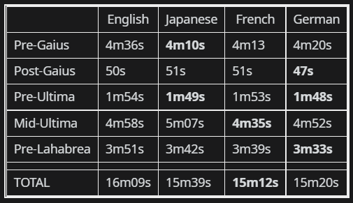

# DEPRECATED

As of patch 6.1, The Praetorium was split into multiple dungeons, so this plugin is no longer useful. I will leave the repo here in case we ever get FF14 classic. 

# FastPraetorium

As you can see, different languages have different length cutscenes within The Praetorium. 

This plugin will automatically choose the fastest language for each cutscene, saving you a total of 76 seconds compared to the English cutscenes. 

This plugin only affects cutscene audio; all text will still be in your preferred language. 

When The Praetorium is over, the cutscene audio language will be reset to its original setting. 
